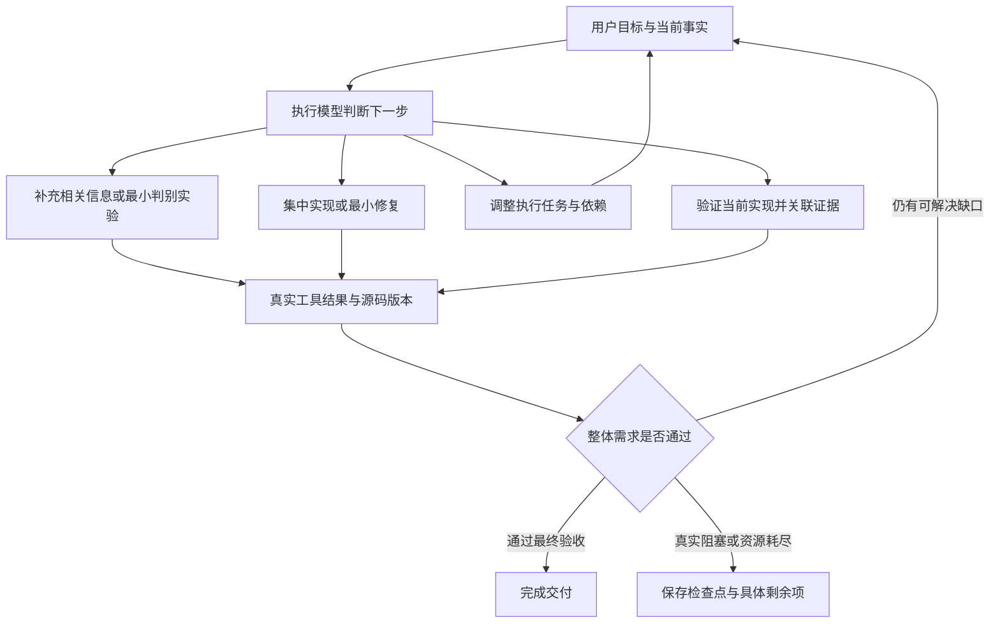

# Agent 的全局决策与执行收敛优化

更新时间：2026-10-10。目标是修复通用的 Agent 执行缺陷，让模型依据可信事实调整路径并完成用户目标。日历项目只作为事故证据；本次没有修改该项目的业务源码或数据。

## 事故证据

项目 `dbae89eef730440ab0f1659286933314` 的增量需求是“增加持久性，现在换个浏览器打开之前的日程就不在了”。对应任务 `25a7e84a-482b-4bb0-9e3d-26b777c56db9` 于北京时间 00:52:47 开始、01:33:02 停止，耗时 **40 分 14 秒**。

| 指标 | 数据库中的实际记录 |
| --- | --- |
| 模型调用 | 148 次：IMPLEMENT 109、PLAN 20、COMPACT 19 |
| 输入 / 输出 Token | 4,972,215 / 97,971 |
| 记录成本合计 | 0.546207 美元 |
| HTTP 工具调用 | 44 次 |
| 非预期 401 | 7 次；每次使用的 token 都与此前实际接口返回的完整 token 不完全一致 |
| 断言误报 | 1 次实际非空日程列表被 `expect_json: {"events": []}` 判成成功 |
| 停止方式 | 最终触发连续 18 轮无有效进展保护，保留检查点；没有完成任务 |

请求凭据仅在内存中比对，复盘不输出 token。脱敏执行记录保存在本机 `.deploy/persistence-agent-incident.json`。

这些记录不能证明所有业务代码均正确。例如，同一事件 ID 被两个账号分别写入后，再断言其中一个账号必须为空，本身就需要先明确测试数据生命周期。模型把错误实验输入、错误断言与实现缺陷混在一起，后续诊断便失去可靠依据。

## 为什么有工具和循环，仍然难以解决问题

1. **模型看到的“事实”可能是假的。** 空列表断言误报会让模型同时看到“有数据”和“已验证为空”；要求它继续推理只会放大矛盾。
2. **工具之间没有可靠的数据流。** 令牌、动态 ID 等必须经过模型抄写，既浪费上下文，又容易串账号、截断或改动值。自然语言模型不适合充当凭据传输管道。
3. **初始任务图被当成不能调整的事实。** 前端阶段需要后端成功证据才能完成，而后端任务又依赖前端完成；局部指令要求只处理当前任务，造成协调死结。
4. **恢复模型与执行模型分离。** 无工具的诊断请求只看到有限快照，生成未验证的假设，再要求另一个拥有完整上下文的执行模型落实。反复轮换诊断视角，不代表获得新事实。
5. **验收合同不可执行。** 路径模板与实际 URL 逐字比较、204 必须提供 JSON、“已认证用户邮箱”等说明文字被当成字面值，都会制造永远消不掉的缺口。
6. **上下文整理会重新灌入大量材料。** 原执行工作集目标为 48K，但压缩后曾达到约 62K，并进行了 19 次付费整理。历史源码、响应参数和任务描述不断挤占当前问题的注意力。
7. **进展判断过于局部。** A→B→A 的源码或任务状态往返，之前可能因相邻哈希不同被当成新进展。

加大轮数、再增加诊断模型、把同一错误重试更多次，无法修复上述基础问题。

## 本次实现的通用机制

### 1. 由执行模型统筹并直接行动

重复失败或无进展时，把整体目标、需求、任务依赖、当前验收缺口、真实失败操作和前次实验结果交给当前执行模型。该模型继续拥有上下文和工具，可以读取原因、实施最小判别实验、修改实现或调整执行顺序。

主恢复路径不再额外调用一个无工具 PLAN 模型生成诊断，也不按计数机械轮换四套诊断视角。反馈明确要求区分实现问题、实验输入错误、证据缺口和任务依赖问题，先更新假设，再选择动作。



这不是保证模型一定选择正确的假设；执行器负责提供可信事实和可调整路径，实际效果仍需真实模型样本衡量。

### 2. 新增 `revise_tasks`，允许模型调整执行计划

模型可合并一个纵向功能单元、拆出具体阻塞、重排独立任务或改变依赖。调用必须说明实际观察、原路径为什么无效及新路径的依据。

原始需求、接口和最终验收保持有效；新任务图必须覆盖全部需求且依赖合法。已变化任务失去原完成状态，未变化任务保留状态，真实证据保留；修改任务图本身不算功能通过。新计划及审计写入持久会话，服务重启后可继续。

前置阶段如果将同一需求交给其后继任务继续完成，可凭当前源码的真实构建或启动证据关闭阶段；最后负责该需求的任务仍须提供真实业务成功证据。最终需求验收不会因为阶段关闭而跳过。

### 3. 工具直接复用响应，模型处理意图而非抄写凭据

`http_request` 支持：

```json
{"path":"/api/auth/login","method":"POST","body":{"email":"...","password":"..."},"expect_status":200,"expect_schema":{"type":"object","required":["access_token","user"]},"save_as":"alice_login"}
```

后续调用使用 `"auth_from": {"response": "alice_login"}`，由执行器逐字复制 Bearer token。不同账号使用独立响应名称。路径、请求体及断言中的 `{{http:response_name:/json/pointer}}` 可引用动态 ID 等真实值；完整字符串引用保留 JSON 类型。

响应绑定保存在当前项目的私有 SQLite 会话中，跨轮次、压缩和 Worker 重启复用；失败断言不会创建成功绑定。压缩记忆保留响应名和账号标识，模型看到的已保存令牌使用引用表达，完整审计仍保留实际响应。多个有依赖的工具调用可由模型在同一响应中按顺序提出并执行。

这不会把 API 登录自动同步到浏览器，也不会自动重试有副作用的业务请求。凭据过期时仍需真实登录并更新绑定。

### 4. 让验收协议能表达真实 HTTP 行为

- 空数组断言要求实际为空；布尔值不会与 0/1 混淆；JSON 不匹配返回明确的断言错误。
- `/api/events/{event_id}` 可匹配实际资源路径；运行时前缀和查询字符串不再造成合同误报。
- 支持 `expect_body: ""` 和 204 空响应合同，不强制解析不存在的 JSON。
- 计划中的明确说明性断言在有类型 Schema 时归入注释，具体字面值仍受约束；无可执行 Schema 的说明性断言会被拒绝。新规划要求动态字段使用 Schema，具体数据关系由真实请求断言验证。
- 再次检查旧证据中的实际 JSON，避免继续信任旧空列表错误判定；仅有健康检查、预期错误或旧源码证据不能代替成功链路。
- 合同规范化兼容旧任务与会话恢复，不因表示形式迁移丢失已有任务状态。
- 最终服务重启后，只回读最后一次可能修改状态的 HTTP 操作之后、同一身份与地址的最新读取断言；后续失败读取会使旧成功断言失效。重启前的运行地址先还原为项目相对路径。不会重放写入、已删除记录或旧运行地址。

### 5. 限制无效循环和上下文回灌

进展判断使用当前版本的真实成功业务检查，并区分接口方法与操作；新日志编号、备注或随机 token 不等于进展。保留最近状态指纹，回到已观察状态不再简单重置停滞计数。已有的 18 轮保护是资源兜底，主要解决方式是此前的证据驱动调整与执行。

压缩后注入的源码工作集上限由 90K 字符降为 24K，并根据剩余上下文预算继续缩小；完整版本化工作集仍可按需读取。近期证据只放必要元数据，任务重点提示按主题替换，避免旧优先级反复干扰模型。

## 验证范围与限制

新增回归覆盖跨账号响应绑定、动态值类型、绑定的项目隔离与重启复用、失败断言不绑定、空列表误报、参数化路径与 204、阶段完成和最终验收区别、任务重组完整性、源码状态往返、上下文压缩预算，以及真实 Agent 工具循环中的“无进展→执行模型重组任务→实现→验收→完成”。

其中模型动作由可控测试响应驱动，用于验证执行器行为；它不证明真实 LLM 的自主成功率。预装模板的真实全栈烟测另外验证实际构建、浏览器写入、刷新、服务重启回读和最终交付检查。

验证结果：89 项专项回归全部通过；83 项集成回归中 80 通过、3 项条件跳过，两组包含重复用例，不作为独立用例总数相加。模板全栈烟测通过，耗时约 32 秒。另外新增真实 HTTP 服务烟测，覆盖两个账号、动态凭据引用、创建与删除、最终状态断言、服务重启后的隔离与持久化回读，耗时约 6 秒，通过。

测试日志：`.deploy/agent-adaptive-regression-tests.log`、`.deploy/agent-adaptive-integration-tests.log`、`.deploy/agent-adaptive-template-smoke.log`、`.deploy/agent-adaptive-auth-restart-smoke.log`。专项回归后的新增真实服务用例单独运行，不混入上述 89 项口径。

修复镜像已于 2026-10-10 部署到 `agent-service`、`backend`、`preview`，健康检查通过，并确认运行环境已加载任务重组、响应绑定和最终状态回读机制。既有项目 Worker 在下一次新任务入队且没有运行中任务时采用新镜像，工作区与检查点保留。没有自动重跑或标记原任务完成。

## 下一步按什么判断优化是否有效

优先建立固定起始快照的三类评估：现有前端接入持久化、带认证的多账号 CRUD、包含配置/依赖故障的现有工程修复。使用同一模型、同一预算和独立测试数据，多次运行，记录真实成功率、总耗时、首次纵向流程通过时间、有效实验数、重复操作数和输入 Token。

优先看是否准确完成需求、是否能根据新证据改变路径，再看调用数。不能以“更早停止”“多了一个规划工具”或某个回归测试通过，替代真实问题解决能力的提升结论。
