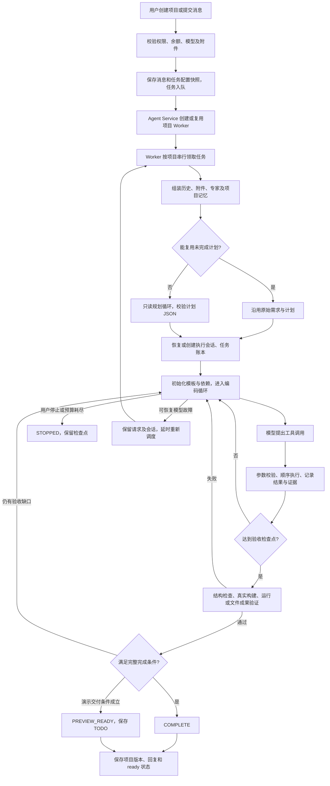
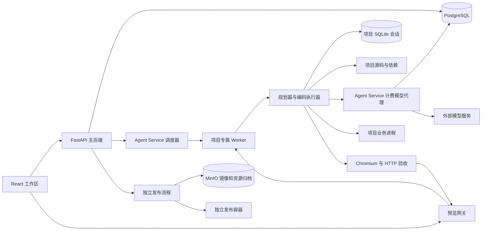

# Agent 构建全过程：流程、架构、工具、循环与上下文复用

[返回 README](../README.md) · [项目简要说明](PROJECT_BRIEF.md) · [已实现能力清单](IMPLEMENTED_CAPABILITIES.md)

本文依据 **2026-10-09 当前工作区源码**整理，包含现有未提交改动。以实际调用路径和条件分支为准；旧文档、提示词或代码注释与执行逻辑不一致时，本文明确说明差异。本文是实现梳理，本次没有重新调用模型或执行完整构建验收。

阅读入口：

- [总体流程](#1-总体流程)与[运行架构](#2-运行架构与职责)
- [任务输入](#4-构建输入如何准备)与[规划循环](#5-规划循环make_plan)
- [编码主循环](#6-编码初始化与主循环)与[工具清单](#7-tools能力参数与开放条件)
- [完成证据](#8-任务依赖与完成证据)与[退出条件和预算](#9-最终验收与退出循环)
- [上下文管理](#10-上下文如何保存组装与压缩)、[缓存分层](#11-缓存分层键复用范围与失效)与[请求恢复](#12-模型请求服务商缓存与计费恢复)
- [错误恢复](#13-无进展工具故障和-job-恢复)、[结果保存](#14-构建结果如何落库发布如何分开)与[源码索引](#16-源码阅读索引)

## 1. 总体流程

一次构建以数据库中的 `agent_jobs` 为单位。模型负责提出计划和工具调用，平台执行器负责调度、校验、执行、持久化以及判断是否允许交付。



这里有两种正常交付：`COMPLETE` 表示满足当前计划的任务和验收门槛；`PREVIEW_READY` 表示当前版本可运行或可查看，但可能仍有延期、模拟或未验证能力。二者最终都可以让任务状态变为 `done`、项目状态变为 `ready`，不能仅看数据库的 `done` 就认定所有业务需求完成。

## 2. 运行架构与职责



| 层 / 模块 | 职责 |
| --- | --- |
| `frontend/src/App.tsx`、`ChatWorkspace.tsx` | 提交需求、选择配置、展示消息与步骤、停止任务、代码编辑及预览。 |
| `backend/main.py` | 账号归属及输入检查、保存项目 / 消息、入队、分发、任务状态接口和 SSE。 |
| `backend/agent_service.py` | 选择项目 Worker，管理容器、网络、资源和生命周期；承载受信任的模型代理及发布操作。 |
| `backend/project_worker.py` | 一个 Worker 只服务指定项目；接受运行、命令、构建、还原及预览请求。 |
| `backend/jobs.py` | 每个项目的 FIFO 队列、执行锁、任务领用、上下文准备、状态日志、结果保存及恢复调度。 |
| `backend/agent.py` | `make_plan()` 规划入口；`run_agent()` 编码主循环；工具处理与最终交付验收。 |
| `agent_harness.py`、`system_contract.py` | 计划结构、任务依赖、需求覆盖、真实证据、系统合同及完成条件。 |
| `agent_session.py` | 持久会话、活动上下文、源码读取缓存、输出归档和阶段复用。 |
| `coding_runtime.py`、`billing_proxy.py` | 模型阶段路由、流式响应、请求恢复、额度预留及真实用量结算。 |
| `runtime.py`、`agent_checks.py`、`delivery_checks.py` | 启动业务服务、HTTP / 浏览器检查、依据真实页面生成验收场景。 |

工作区通常在宿主持久卷的 `projects/<project_id_hex>`，Worker 内挂载为 `/workspaces/<project_id_hex>`。每个项目有独立 UID、容器和网络；项目命令及业务子进程降权执行。Worker 的协调进程使用 root 管理文件归属和子进程，但容器有只读根文件系统、资源配额和受限能力。

Worker **不持有上游模型 API Key**，模型请求携带 Worker Token 和当前 job ID 发给计费代理。生成的业务子进程又使用单独的运行环境，不继承平台模型、数据库管理和存储管理凭据。源码检索跳过依赖、构建产物、私有会话、附件和数据目录；文件工具校验路径与符号链接，限制 `.env` 等敏感文件访问。这些工具边界与命令执行环境共同作用，不应理解为“文件工具禁止的目录对所有 shell 操作也完全不可见”。

界面中的 Mike / Alex 分别是规划和执行角色标签。当前构建通过同一个 Worker 内的规划函数与编码循环协作，**没有启动多名并行编码 Agent**。任务可表达独立依赖，但执行器依次选择任务，同一模型响应内的多项工具调用也顺序执行。

## 3. 从请求到任务领用

1. 创建项目调用 `POST /api/projects`，后续需求调用 `POST /api/projects/{id}/messages`。后端检查余额、模型、项目归属、附件、专家及引用文件。
2. 保存项目和用户消息；`enqueue_project()` 保存 prompt、模型、档位、`enabled_tools`，以及专家 ID / 版本 / 完整 skill 内容 / SHA256 快照。专家注册表后续变化不会改写已入队任务。
3. `dispatch_project()` 请求 Agent Service 的 `run` 操作。主后端每 10 秒扫描需要分发的项目，处理初次分发失败及到期的恢复任务。
4. `ensure_worker()` 创建、启动或复用项目容器。配置、镜像或挂载变化时，在允许的空闲 / 待执行状态更新 Worker；繁忙任务受保护。
5. Worker 的 `schedule_project()` 启动项目队列。`process_project_queue()` 持有项目 `asyncio.Lock`，按创建时间和 ID 领取最早的 `queued` 任务并改为 `running`。
6. 队列为空、项目不存在 / 删除中，或者队首还没到 `retry_after` 时退出队列函数。后续任务不会越过正在等待恢复的旧任务。

一个项目内串行运行，不同项目可在资源限额内同时运行。API 返回和 Worker 接受 `run` 只表示任务已保存 / 调度，构建过程在后台继续。

## 4. 构建输入如何准备

`jobs.py` 为本次任务准备以下输入，而不是把数据库里的全部历史无限追加到模型请求。

| 输入 | 当前取法 |
| --- | --- |
| 对话历史 | 当前任务之前最近 8 条消息，转为时间正序；附加历史文件引用和页面元素定位数据。 |
| 当前文件引用 | 将当前引用文件的前 6,000 字符加入任务 prompt，其余通过读取工具获取。 |
| 项目文档 | 最多 100 条文档清单，包含 ID 和提取文字长度；本次上传文档各提供前 5,000 字符。 |
| 当前图片 | 查询模型图片输入能力，使用模型视觉输入；不支持时走已配置的本地视觉服务。输出视觉事实描述及附件路径，传入后续文本上下文。 |
| 历史图片 | 当前没上传图片时，补充最多两条此前视觉识别记录的片段。 |
| 专家指令 | 从当前 job 保存的专家快照生成，参与规划和执行 system 指令。 |
| 项目记忆 | 私有会话里的架构、命令、需求、摘要、任务和近期操作；必要时补充最近 8 个版本的摘要。 |
| 已耗用预算 | 汇总当前 job 的 usage 步骤，得到已调用次数和 Token 数，传给编码阶段。 |

图片识别是独立模型调用；规划和编码通常拿到识别描述，不能把它理解为原始图片始终留在每一轮编码上下文。文档全文保存在附件记录中，模型用 `read_document` 按 ID 分页访问。

## 5. 规划循环：`make_plan()`

### 5.1 恢复旧计划，还是生成新计划

`resumable_plan()` 检查 `.atoms/task-state.json`：旧任务未完整完成，且当前请求等于旧请求或属于固定的“继续 / continue / resume”等表达时，返回原始需求和计划。

`jobs.py` 进一步要求：档位相同、策略版本兼容、专家快照未变化、本次没有新图片 / 文档，才直接沿用旧计划。切换档位时重新规划原始目标，而不是把“继续”二字当作新业务需求。改变工具选择会重新盖上当前工具策略；任务账本允许忽略 `enabled_tools` 差异恢复任务，但执行会话的精确计划哈希仍可能发生变化。

普通的新需求走 `make_plan()`。已有项目从旧计划中继承未变化的应用类型、架构、命令和文件成果合同，生成当前新增需求的任务；旧需求进入 `preserve_requirements`。它不会默认重做全部历史任务。

### 5.2 规划上下文与本地代码索引

规划最初的两条消息包含：

```text
system
  计划输出合同
  + 当前工具选择与构建档位
  + 默认模板策略
  + 专家技能
  + 已有项目增量修改约束
user
  最近有效对话 + 当前需求 + 附件参考
  + 新项目 / 已有项目事实
  + 持久项目记忆
  + 文件清单（最多列出 200 个）
  + 文件变化提示
```

已有项目还可附加明确引用路径的历史源码观察、`.atoms/ARCHITECTURE.md` 前 6,000 字符和最多约 4,500 字符的模块概览。历史观察会先核对完整文件哈希；当前调用优先复用 prompt 中明确提到的文件，而不是无条件灌入全部读取缓存。

`CodeLocator` 在私有 SQLite 的 `source_index` 中维护符号、路由、表名和静态 imports。文件元数据指纹包含索引版本、size、mtime、ctime、inode；未变化时复用索引，变化时重新计算内容哈希和事实。超过 120,000 字节的文件仍可处理，但不在这一步完整解析符号。`imports/imported_by` 只是静态线索，动态调用和 API 消费关系仍要搜索或运行验证。

### 5.3 规划循环上限与退出

理解、探索、输出计划现在是**一个只读模型循环**。界面仍显示 `UNDERSTAND → EXPLORE → PLAN`，不代表固定执行三次模型请求。

| 场景 | 可读取探索轮数 | 额外计划合成轮数 | 最多模型轮数 |
| --- | --- | --- | --- |
| 全新项目、没有业务源码 | 0，工具列表为空 | 2 | 2 |
| 已有源码、有有效历史基线 | 3 | 2 | 5 |
| 已有源码、没有有效历史基线 | 6 | 2 | 8 |

每轮若模型返回只读工具，执行后把结果写入阶段上下文，继续下一轮；信息充足时模型可以提前输出计划。探索轮数到达后关闭工具，要求只输出完整 JSON，留一次合成修正机会。

成功退出需要通过：JSON 外层解析、应用类型 / 目录 / 命令校验、需求 ID 和验收类型校验、任务依赖与覆盖校验、文件成果合同、系统合同，以及已有项目的 `change_map` 校验。`change_map` 要将真实修改 / 新建 / 删除路径关联到需求，并与任务文件一致。

输出截断、格式错误或结构缺口会反馈具体错误，在剩余轮数内修正。轮数用完仍没有可执行计划则抛错，保存已有源码观察，不进入编码。规划轮数是单独的硬边界，并不是编码循环的 200 轮配置。

### 5.4 阶段缓存和源码交接

`session.phase('planning', phase_key, ...)` 保存规划消息、观察、轮数和完成计划。key 包含请求、有效历史、源码清单哈希、规划策略版本、档位、工具、专家和规划模型。

同 key 可恢复未完成阶段或直接返回已完成计划；输入变化则建立新的规划阶段。成功后保存 `.atoms/requirements.json`。

进入实现时，`planning_handoff()` 再验证 request、plan hash 和观察中的源码哈希，将最多约 18,000 字符观察及已定位改动版本交给编码器。变化文件标记为需要重新读取，避免规划读取完又把同一批源码重新扫描一遍。

## 6. 编码初始化与主循环

### 6.1 进入循环之前

`run_agent()` 依次执行：

1. 保存初始源码快照，规范化计划、档位和工具选择。
2. 创建 `TaskLedger` 和 `AgentSession`，尝试恢复任务、操作记录、消息及预算。
3. 组装执行 system：编码指令、验证策略、外部依赖策略、专家、文件成果合同及档位规则。
4. 组装初始 user：当前需求、附件、计划、项目记忆和规划源码交接；有有效项目记忆时减少重复历史消息。
5. `session.start()` 恢复兼容会话，或者新建执行窗口；准备 `ExecutionGuard`、工具列表和上下文目标。
6. 新 Web 项目优先安装可信默认模板并准备依赖；指定技术栈走相应初始化方式。已安装模板的源码和规范按读取页交接给模型，减少重新读模板或再次初始化。

执行器是否“新项目”由实际业务源码决定，`.atoms` 中的初始元数据不算业务源码。

### 6.2 每一轮的执行顺序

下列伪代码保留关键分支，省略日志和部分异常处理：

```python
while True:
    if implementation_budget_near_limit():
        enter_stabilization()

    check_user_stop()
    check_repair_budget_and_deadline()
    count_this_iteration()

    if repeated_failures_or_no_progress():
        diagnose_current_facts_once_per_fingerprint()
        add_targeted_recovery_guidance()

    compact_context_if_needed()
    select_next_task_by_dependencies()
    refresh_one_coordinator_directive()
    checkpoint_before_model_request()

    assistant = call_model(IMPLEMENT_or_STABILIZE, messages, allowed_tools)

    if assistant.has_tool_calls:
        append_assistant_and_checkpoint()
        for tool_call in assistant.tool_calls:  # 顺序执行
            validate_schema_and_policy()
            execute_or_reuse_allowed_result()
            record_real_evidence_if_applicable()
            append_tool_result()
            checkpoint_files_tasks_and_messages()
        if not_acceptance_checkpoint():
            continue

    if task_still_open_and_no_checkpoint():
        ask_to_finish_current_task()
        continue

    check_plan_conformance_and_source_syntax()
    run_or_reuse_build()
    if failed:
        add_concrete_error_and_continue()

    if delivery_conditions_apply():
        verify_real_runtime_or_artifact()
        if failed:
            add_concrete_error_and_continue()
        if demo_delivery_conditions_apply():
            return PREVIEW_READY

    if completion_issues_exist():
        add_issues_and_continue()
    return COMPLETE
```

每轮的协调指令先删除旧的同类动态消息，只保留一份，包含当前任务、相关模块契约、系统决策事实和推进节奏；插在最新 assistant/tool 交换之前，避免拆散协议要求的工具配对。当前任务切换时另外追加一次任务提示。

工具调用响应先持久保存，再逐个执行。因此进程中断后能区分“模型已提出的操作”和“已提交的操作结果”。模型不返回工具而给出总结，**不会直接结束任务**：执行器继续检查实际文件、任务及验证证据。

### 6.3 哪些情况触发整个交付检查

通常实现阶段只运行模型请求的局部工具，不每轮都构建整个项目。以下情况进入交付检查：

- 最后一个活动任务被更新为 `done` 或 `deferred`，所有任务均已关闭。
- 进入演示收尾阶段；其中只有读取 / 查询类工具的一轮通常继续执行，不立即跑整套检查。
- 到达实现轮数边界的检查点。
- 模型暂时不可用，先检查当前成果能否实际交付。
- 连续三轮全部工具参数被拒绝，转到系统检查寻找可执行的推进路径。
- 没有工具调用且任务已完成，进入完成门槛检查。

`in_progress` 的备注更新或普通源码读取不是完整验收边界；模型过早总结且仍有任务未完成时会被引导继续。

## 7. Tools：能力、参数与开放条件

当前注册了 **26 个模型工具**，由 `agent.py` 的基础工具、`code_locator.py` 的定位工具和 `tool_specs.py` 的完整合同共同组成。默认模板安装、源码结构检查和最终交付启动检查还可以由 harness 自主执行，它们不都属于模型可调用工具。

| 分组 | 工具 | 核心参数 / 行为 |
| --- | --- | --- |
| 源码列表 | `list_files` | 无参数，返回允许访问的源码路径。 |
| 批量读取 | `read_files` | `files:[{path,offset?,limit?}]`，最多 16 个，合计最多 60,000 字符；超预算按顺序缩小读取量。 |
| 单文件读取 | `read_file` | `path, offset?, limit?`，字符分页，默认 10,000，最大 12,000。 |
| 文件写入 | `write_file`、`write_files` | 完整内容写入；批量最多 12 个文件，先校验全部目标；实际文件写入不是原子事务。 |
| 文件修改 | `replace_in_file`、`apply_patch`、`delete_file` | 唯一逐字匹配替换、精确上下文补丁或删除；不做模糊匹配。 |
| 常规搜索 | `search_files`、`symbol_search`、`show_diff` | 文本搜索、定义查找、与当前任务起始快照比较差异。 |
| 需求定位 | `locate_change` | `queries` 最多 12 个词，结合路径、符号、路由、表名及 imports 查候选；默认 12，最多 20 个结果。 |
| 文件名定位 | `glob_files` | `pattern,offset?,limit?`，按文件名模式分页查询，默认 50、最多 100。 |
| 调用搜索 | `search_code` | `query, include?, regex?, offset?, limit?`；实际使用 rg，不调用 shell；默认 40、最多 80 项。 |
| 按行读取 | `read_code` | `path,start_line?,max_lines?,symbol?`；默认 100、最多 160 行，实际正文仍受约 12,000 字符限制。 |
| 文档输入 | `list_documents`、`read_document` | 获取附件文档 ID，按 ID 与字符区间读取提取文本，最大单页 12,000。 |
| 输出检索 | `read_tool_output` | 按真实 `output_id` 分页读取已归档结果，默认 6,000、最大 12,000。 |
| 执行命令 | `run_shell` | `command,timeout?,requirement_ids?`；非交互 Bash，启用 `errexit + pipefail`，预期失败需使用 `if` / `||`。默认 90 秒、最大 180 秒，超时返回 124 并终止进程组。 |
| 工程初始化 | `scaffold_project` | 真实 Vite CLI，默认 `frontend/react-ts`，支持六种 TS 模板；不覆盖已有非空目录。 |
| 实际构建 | `run_build` | 可关联 `requirement_ids`；优先工作区配置，其次适用计划命令，再其次根 package build。 |
| 任务查询 | `get_tasks` | 紧凑任务、证据及 `completion_issues`；不反复返回整份计划和长日志。 |
| 任务更新 | `update_task` | `id,status,note?,evidence_ids?`；支持 pending / in_progress / done / deferred。 |
| 服务运行 | `runtime_check` | 无参数，启动 / 复用配置的前后端服务，返回就绪和日志。 |
| HTTP 验证 | `http_request` | `path,expect_status` 必填；可指定 service、method、headers、body / form、expect_json / expect_schema 和 requirement_ids，限定当前项目。 |
| 浏览器验证 | `browser_check` | `path?,actions,requirement_ids?`，模型调用需 1–40 个动作；真实 Chromium，通过实际预览网关执行。 |

`glob_files` 的合法参数是 `pattern,offset,limit`，其他定位工具的 `include` 不能直接套用。上表中的所有参数仍以代码 schema 为准。

浏览器动作支持：`click`、`fill`、`fill_from_text`、`press`、`check`、`uncheck`、`select`、`reload`、`assert_visible`、`assert_text`、`assert_value`、`assert_count`、`assert_response`。API / 浏览器工具不接受任意外部 URL。浏览器状态与 API 工具状态分开，API 登录不会自动登录浏览器。

### 7.1 每个阶段开放哪些工具

| 阶段 / 条件 | 开放规则 |
| --- | --- |
| 规划探索 | 仅 list / read / search / symbol / discovery / output，只读，不开放写入和命令。 |
| 空白新项目规划、计划合成 | 无工具，直接输出计划 JSON。 |
| Web / service 执行 | 原则上开放执行工具，再应用用户选择和档位限制。 |
| CLI / library / artifact | 移除 scaffold、runtime、HTTP、browser 四类 Web 工具。 |
| 未勾选浏览器验收 | 移除模型 `browser_check`；平台最终仍执行 JavaScript 首屏启动检查。 |
| 普通 Web 且无显式 API 验收需求 | 移除 `http_request`；显式 API 验收需求可执行完整代表性流程，不受旧的一次检查限制。失败不自动降级为 TODO。 |
| 已安装默认模板 | 移除 `scaffold_project`，避免再次初始化。 |
| 某工具连续调用失败 | `ToolRecovery` 将它从接下来三轮的可用工具中临时移除。 |

### 7.2 工具调用如何校验及记录

`parse_tool_arguments()` 先检查工具是否在本轮列表中，再解析严格 JSON，拒绝重复字段、错误类型、未知字段、NUL、越界路径等。正整数超出读取页 / 超时上限时可限到上限并返回调整说明，缺少文件路径或断言不会猜测补齐。

模型响应 `finish_reason=length` 时，当前响应的工具调用拒绝执行，避免运行截断参数。流提前结束且没有完整结束标记时也不会执行半截工具调用。

成功命令 / 构建 / HTTP / 浏览器等检查生成 `V1`、`V2` 等验证 ID，记录工具、实际退出码、源码摘要、需求 ID 和结果。工具参数错误返回 `executed:false`，一项失败不回滚同一响应里此前已执行的操作。真实完整捕获结果另外归档为 `O...` 输出 ID，模型看到有界内容和检索入口。

局部单元测试可用于当前修改诊断，但记录为 `local_unit_check`，不作为需求完成证据；Web / service 的最终交付不自动执行统一单元测试套件。

## 8. 任务依赖与完成证据

`TaskLedger.next_task()` 优先返回已有 `in_progress` 任务；否则从计划中选取依赖都为 `done/deferred` 的 `pending` 任务，并标为执行中。

`update_task(done)` 要关联确实成功且符合验收策略的验证 ID。带系统合同的任务还要求证据对应当前源码、真实成功业务结果，覆盖该任务关联需求；构建、健康检查和预期拒绝响应不能代替正常业务成功链路。`deferred` 必须写明已实现 / 模拟内容、缺口及后续步骤，它可以解开依赖，但不等于完整完成。

最终 `completion_issues()` 进一步检查：

- 每项任务必须为 `done`；延期任务不能进入完整完成。
- 证据非历史、执行成功、对应当前源码，并属于需求规定的验证类型。
- 模块接口文件、工程结构、初始化记录及适用 README 要存在。
- 必要后端有真实源码及适用的 HTTP 证据；开启浏览器交互验收时有适用浏览器证据。
- 系统合同的真实外部服务及用户链路要求得到满足。

恢复旧任务时，旧账本证据会被标为 `historical:true`，保留任务状态用于续建，但不能仅凭旧证据进入 `COMPLETE`。各层缓存可以节省明确允许的重复操作，是否形成新证据取决于实际分支，不能把缓存命中直接当作全新的业务验收。

## 9. 最终验收与退出循环

### 9.1 构建与运行检查

完整检查先做计划一致性及 Python / JSON 结构检查，再执行真实 build / 类型检查。构建通过后按应用类型验证：

| 应用类型 / 策略 | 最终检查 |
| --- | --- |
| 普通 Web，或收尾 / 模型故障 / 延期依赖导致的 Web 演示路径 | 实际重启服务，通过 Chromium 执行 JavaScript，检查挂载、空页面、模板占位和致命错误，再检查入口 HTTP；不自动运行完整业务交互矩阵。 |
| 深度 / 高级 Web，开启浏览器工具，走完整验收 | 执行真实核心场景、页面及响应断言；场景基于配置或真实控件生成，不能只断言 body 可见。 |
| 深度 / 高级 Web，未开启浏览器工具 | 仍检查真实 JavaScript 启动；适用时在重启后执行已有业务 GET / HEAD 的数据回读，不重放写入。 |
| service | 启动必要服务并执行实际业务 HTTP 回读；需要后端时健康接口不代替数据接口。 |
| CLI / library | 执行配置的真实产品运行 / 演示命令，过滤单元测试运行器；缺少可执行命令不能只保存源码交付。 |
| artifact | 实际文件可打开、正文和页数 / 行数检查，以及真实预览；不强制前后端或软件 README。 |

`resolve_scene()` 最多两次模型请求生成 / 修正场景 JSON。执行中只有选择器 / 断言不匹配而没有真实运行或网络故障时，可依据实际浏览器反馈纠正场景，最多两轮；业务确实缺失则返回编码循环修复。场景合同缓存不等于浏览器成功结果缓存。

### 9.2 退出条件一览

| 条件 | 行为 | 是否表示全部完成 |
| --- | --- | --- |
| 所有适用完成检查无缺口，运行 / 文件验收通过 | 标记账本 completed，保存 acceptance，返回 `COMPLETE`。 | 是，限于当前计划和实际验收范围。 |
| 演示检查通过，且处于收尾、模型暂不可用、存在延期项或普通 Web 演示路径 | 写交付 TODO 和 demo 状态，返回 `PREVIEW_READY`。 | 否。 |
| 用户 stop_requested | `await_or_stop()` 在等待模型 / 工具时每约 0.75 秒检查，取消当前等待，抛 `AgentStopped`，任务 stopped。 | 否。 |
| 总执行 deadline 到达 | 保存会话和文件检查点，抛 `DeliveryLimitReached`。 | 否。 |
| 连续 18 轮没有源码、任务状态或需求成功验证变化 | 经过多次恢复机会后停止无进展循环，保存检查点与具体阻塞；新人工任务重置无进展计数，同一任务自动恢复保留计数。 | 否。 |
| 独立收尾 Token / 模型调用 / 循环轮数达到上限，或剩余额度无法容纳请求 | 保存检查点并停止，不自动重启验收循环。 | 否。 |
| 规划校验轮数耗尽、鉴权 / 配置 / 余额等不可恢复错误 | 保存错误，任务 error，项目 error。 | 否。 |
| `ModelTemporaryError` | 编码阶段先尝试当前成果交付；不能交付时由 job 恢复机制处理。 | 否，可能稍后自动继续。 |

重复错误和无进展会触发诊断及策略切换，**当前 ExecutionGuard 不因为简单失败计数直接终止任务**；真正停止由用户、预算、deadline 或不可恢复异常决定。

### 9.3 预算何时转入收尾

基础值来自环境变量，档位倍数默认普通 1、深度 2、高级 3：

```text
task_token_limit = max(10000, AGENT_MAX_TOKENS 默认 15000000) × 档位倍数
task_iteration_limit = max(1, AGENT_MAX_ITERATIONS 默认 200) × 档位倍数
repair_token_limit = task_token_limit // 2
repair_iteration_limit = task_iteration_limit // 2
```

`DeliveryBudget.due()` 在以下任一条件成立时，从 implementation 切为 stabilization：

- 实现 Token 已到上限的 85%。
- 已用 Token + 当前请求估计量 + 12,000 预留将达到上限。
- 实现循环轮数或模型调用数到达配置轮数的约 80%。
- 编码阶段可用时间消耗约 90%。

收尾有独立预算，但共享执行 deadline，进入收尾不会自动增加时间。当前 `run_agent()` 在规划之后创建 deadline，默认 3,600 秒、最低 60 秒；所以它不是从用户点击发送起精确计算的全流程超时。规划和图片调用的实际用量仍作为 initial tokens / calls 计入实现预算。

复杂度 simple / medium / complex 的 16 / 40 / 120 轮仅是 `ExecutionPacing` 的节奏建议，不缩小真实配置上限。一次主循环不等于一次工具执行：一个响应可执行多项工具，诊断、压缩和场景生成又可产生额外模型调用；因此计数器分别保存 calls 和 iterations。

同 job 自动重试恢复原 deadline 和已用实现 / 收尾预算；手动“继续”创建新 job，可以重新获得本轮执行预算，同时继承可恢复的项目工作。

## 10. 上下文如何保存、组装与压缩

### 10.1 持久数据与活动窗口

```text
项目工作区
├── .atoms/
│   ├── requirements.json             规划结果
│   ├── PLAN.md                       可阅读的目标、架构和任务
│   ├── task-state.json               计划、任务、证据和 completed
│   ├── LAST_RUN.json                 上次账本备份
│   ├── checkpoint.json               兼容旧格式的近期任务 / 操作
│   └── .agent-session/session.sqlite3
│       ├── checkpoint                当前私有会话状态
│       ├── events                    增量消息与阶段事件审计
│       ├── reads                     文件版本 / 区间读取缓存
│       ├── outputs                   完整捕获的工具输出
│       ├── phases                    planning / delivery_scene 阶段
│       └── source_index              本地代码定位事实
├── .atoms-workspace.json              运行、构建、服务与 demo 配置
├── .npm-cache/dependency-state.json   Node 依赖安装指纹
└── .python-cache/dependency-state.json Python 依赖安装指纹
```

SQLite 使用 WAL、`synchronous=FULL` 和事务保存 checkpoint / event；私有目录权限 0700、数据库文件 0600。PostgreSQL 保存面向平台的 messages、jobs、steps、versions 和 billing 等记录，**项目 SQLite 是执行记忆，PostgreSQL 是平台记录，服务商缓存不是二者的替代品**。

活动窗口是下一次模型请求发送的 `messages + tools`。完整审计与归档不会每轮全部回放。`session_status()` 可返回消息数、上下文估计、压缩 / 整理次数、读取命中、源码工作集及预算等摘要，不对普通页面返回全部私密模型轨迹。

每次工具执行后更新 messages、任务、journal 和文件清单，再保存 checkpoint。增量 events 通过比较上一次消息的共享前缀，只记录变化尾部；journal 在执行状态中保留最近 40 条，在提示词中通常取最近 12 条。

“完整输出归档”是指工具处理器已经捕获的结果：例如命令执行本身只保留约 16,000 字节输出尾部，归档不会恢复该处理器此前丢弃的 stdout。

### 10.2 会话恢复如何匹配

`AgentSession.start()` 满足以下条件才原窗口续接：request 相同、plan hash 相同、旧 completed 为 false，且存在消息列表。

- 模型或 system hash 变化：保留可观察消息，替换 system、移除不可迁移 reasoning，并增加 epoch。
- 文件变化 / 删除：标记这些文件的旧观察失效，删除相关读取缓存，提示针对性重读。
- 不兼容：建立新执行窗口，复用项目 session ID、旧摘要、原始需求线索和近期操作，而不是完整重放旧模型对话。

`repair_tool_boundaries()` 为未提交结果的 tool call 补一条“可能已执行，先核实状态”的结果，丢弃孤立 tool 消息，不自动再次执行写入、删除、HTTP 或命令。

### 10.3 上下文目标与输出预算

`estimate_tokens()` 是本地估计：非 ASCII 字符约计 1，ASCII 约计 0.34，编码 messages 和 tools 后加 256。它用于窗口整理和预算预留，计费始终使用服务商 usage。

`preferred_context_tokens()` 优先数字形式的 `AGENT_CONTEXT_TOKENS`；Compose 默认 `auto`。执行阶段按复杂度采用 simple 32,000 / medium 48,000 / complex 96,000 Token 的活动目标，旧输出和源码仍保存在会话存储中。显式数字配置保留其优先级。实际编码目标还会被裁为：

```text
context_ceiling = max(4096, model_window - min(32000, model_window // 4) - 4000)
context_target = min(preferred_context_tokens(model_window, complexity_level), context_ceiling)
```

不再对所有模型固定预留 132,000 Token：该旧行为会把 128K 模型的目标压到 4K，固定工具 schema 超过目标时反复付费摘要。Gateway 对新请求另外用实际输入估计动态裁剪输出额度；pending 请求按原载荷和原计费 ID 恢复。后续请求仍可能被服务商拒绝，触发强制整理，本地估计不是精确 tokenizer。

阶段输出上限由模型目录窗口、`AGENT_MAX_OUTPUT_TOKENS` 和阶段 cap 共同决定：PLAN / IMPLEMENT / STABILIZE 默认最多 128,000，TEST / REVIEW 等最多 65,536，COMPACT 最多 32,768。收尾阶段还扣除当前输入估计量，剩余输出小于 512 时停止。上限不要求模型用满。

部署生效范围需看环境传递：当前 Worker 明确传递档位预算、上下文、超时和部分阶段模型；`AGENT_MAX_OUTPUT_TOKENS` 及部分额外阶段模型变量并未全部列入 Worker 环境转发，不能只改主服务环境就假定项目容器自动生效。

### 10.4 两级上下文整理

第一层是 `session.prune()`，不调用模型：

- 只在窗口超过目标时考虑整理，保留近期完整 assistant/tool 组，至少最近两组，并按约 8,000 Token 的近期量向前扩展。
- 将早期已执行写入正文替换成“以当前文件为准”，将长工具结果归档并保留头尾。
- 至少能节省 `max(2000, target / 10)` 才改变窗口，避免每轮破坏前缀缓存。
- 整理后移除不可迁移 reasoning，增加 epoch 和 prunes 统计。

第二层是模型摘要：轻量整理仍不够时调用 COMPACT，用低推理强度整理原始目标、旧摘要、任务状态、近期操作和部分对话正文。失败时用已有任务检查点和旧摘要构造窗口。

`session.compact()` 重新组成：system + 原始需求 + 摘要 / 架构 / 完整需求 / 任务状态 / 近期证据元信息 + 最近源码工作集 + 最近工具组。若还大于原窗口，会进一步省掉近期组；仍未缩小时保留原窗口。

源码工作集只保存单文件不超过 24,000 字符的完整内容，总量最多 120,000 字符，压缩时最多注入约 90,000 字符；checkpoint 根据文件变化移除过期项。压缩结果记录 `compaction_floor`，后续需有约 8,000 Token 的新增长才再次触发常规摘要，防止固定指令太大导致每轮付费压缩。

恢复、任务缺口、工程一致性和完成缺口反馈分别按主题替换活动窗口中的旧反馈，全文保留在 SQLite 审计事件；不删真实用户需求或工具调用/结果配对。诊断缓存忽略成功输出中的耗时、随机记录和滑动尾部，不同源码、任务状态、缺口或新判别检查才使诊断失效。

规划阶段使用独立 `phase_window()` 整理：保留初始两条消息、用户纠正和最近完整工具组，早期观察归档；它不是每轮调用 COMPACT。执行请求遇到 `ModelContextOverflow` 时强制整理后再请求一次。

## 11. 缓存分层：键、复用范围与失效

| 缓存 / 复用层 | 键或判断条件 | 复用内容 | 失效 / 限制 |
| --- | --- | --- | --- |
| 代码索引 | 文件元数据指纹 + 索引版本，存完整内容哈希 | 符号、路由、表、imports 等本地事实 | 文件元数据或索引版本变化；大文件不完整解析符号。 |
| 文件区间读取 | `path + 完整内容 SHA + offset + limit` | 已读取区间；最多保留最近 250 条 | 仅当相同内容仍在当前消息，或当前消息中有同哈希的 write_file(s) 正文，才返回短引用；否则返回真实内容。 |
| 规划阶段 | request、历史、files、policy、tools、tier、expert、model 的哈希 | 未完成轨迹或已完成计划 | 任一键输入变化重新建阶段。 |
| 规划到实现交接 | request + plan hash + 每个观察的 source SHA | 已核验源码观察和变更位置 | 文件变化需重读；不凭旧观察继续修改。 |
| Node 依赖 | package / lock / npmrc 内容哈希 + 安装 marker mtime | 现有已验证安装或镜像预热依赖 | 清单、marker 变化；预热匹配后独立复制到项目。 |
| Python 依赖 | requirements 指纹 + 私有解释器版本 + 环境版本及 marker | 项目安装或镜像预热安装 | 清单变化在 staging 安装后替换，失败保留旧环境。 |
| 运行服务 | 源码摘要 + 命令 + services 配置 + 所有进程仍存活 | 现有服务和预览运行状态 | restart=true、源码 / 配置变化或进程退出；最终检查通常显式重启。 |
| 构建成功结果 | `ExecutionGuard` 工具名 + 参数 + source；另有本 run 的 successful_build | 实际成功的 build 输出 | 只在 reusable=true 的构建路径允许成功复用；shell 清空局部 successful_build；不是所有 shell 成功都可重放。 |
| 模型 browser_check 成功 | source + 全部 args + 浏览器状态文件内容 | 真实通过报告和原验证 ID，最多 24 项 | 任一键变化；命中时不新增验证 ID，也不再执行动作。 |
| 完整交付成功 | source、运行配置、成果内容、档位 / 策略、工具、场景、启动策略 | 完整交付报告 | 当前路径要求本 run 的 final_verified_key 匹配及持久缓存 mode=full；新 run 不无条件跳过启动，preview-only 不写 full 验收缓存。 |
| 验收场景合同 | `grounded-scene-v3 + plan hash` | 依据页面形成的动作 JSON | 失败反馈可清除场景；不是成功结果，新源码不能因此免验收。 |
| 恢复诊断 | 当前源码、运行事实、缺口及错误的诊断指纹 | 同事实的诊断假设，最多 24 项 | 新事实改变 key；诊断仅是假设，必须用真实检查确认。 |
| 模型请求幂等 | payload + job 的指纹、stage 和 request ID | 原请求已保存的完整响应 | 仅恢复同一请求；新用户 job 或有效载荷变化是新调用，不是通用回答缓存。 |
| 服务商前缀缓存 | 稳定消息前缀、session_id、模型 / 路由和服务商规则 | 上游计算缓存 | 前缀、epoch、模型、路由、时效变化可能失效；不保证命中。 |

源码摘要来自允许快照的文件哈希集合，排除 `.atoms/` 和 `tsconfig.tsbuildinfo`。它不是业务数据库、浏览器所有状态、远程服务状态或完整 node_modules 的哈希。相同源码不代表所有外部世界都相同，因此只在代码明确允许的位置复用；需要真实重启 / 数据回读的路径仍执行检查。

浏览器缓存键还包含 session 浏览器状态文件；一次操作可能改变它，随后相同 actions 的 key 也可能变化。不能将这层简化成“相同代码就永远不再跑浏览器”。

文件读取命中主要减少重复正文进入模型上下文；当前 `session_read_file()` 仍先读取 / 获取文件内容并计算版本，不能据此声称每次命中都省掉磁盘 IO。它也不是模型永久知道该文件：内容一旦离开活动窗口，就需要提供真实区间或压缩中保留的源码工作集。

## 12. 模型请求、服务商缓存与计费恢复

### 12.1 模型如何路由

`ModelGateway.model_for(state)` 优先 `AI_<STATE>_MODEL`，STABILIZE 可退回 `AI_IMPLEMENT_MODEL`，最后使用用户所选模型。实际可配置范围还受 Compose / Worker 环境转发限制。

Worker 的请求发送到 `/projects/{id}/model`，携带 `_billing_job`、`_billing_request`、`_billing_stage`。代理校验 Worker Token、job、模型及参数，预留积分后请求上游。流式解析完整 content、tool_calls、reasoning、usage 和 finish_reason；缺完整结束标记不执行工具。

当前受信任代理消费上游流后向 Worker 返回完整 JSON，前端主要通过步骤事件和状态同步展示进度；不能将上游 SSE 解析等同于每个 Token 都实时透传到页面。

### 12.2 上游前缀缓存

OpenRouter 请求使用稳定身份：规划为项目级 `atoms:<project>:planning`，主执行为项目 session ID + epoch + `:main`，摘要用 `:compact`；代码中还保留 `:review` 身份。

Anthropic 请求在 system、初始 user 和滚动末尾最多三个位置附加 ephemeral cache_control，其他支持隐式缓存的模型按服务商规则处理。普通续建尽量保持前缀；轻量整理、摘要、模型 / 指令切换、文件变化提示或加密 reasoning 路由恢复时会移除不可迁移 reasoning 并变化 epoch / 身份。

本地缓存不是把上游缓存复制到磁盘；缓存读写 Token 和 provider cost 只展示实际 usage，平台积分按模型目录定价结算。缓存命中不代表本次调用免费。

### 12.3 请求重试与防止重复扣费

1. 模型调用之前持久保存 `pending_model` 的完整 payload 和原请求 ID。
2. `billing_proxy` 用请求 ID / 内容指纹预留额度；同请求已有 response 时返回原响应，有活跃上游任务时等待同一任务。
3. 先保存完整响应，再结算真实 usage。响应已保存但用量缺失时，不重新付费生成，保留等待对账。
4. 网络读写中断不能证明模型未执行，未知请求保持原 ID；不能立即换 ID 再生成一次。
5. 只有受信任代理确认 `retry_safe=true` 的终止失败，才换 ID 发起新尝试；真实产生的用量仍单独结算。
6. `ModelGateway.chat()` 常规最多三次尝试：一般退避 1 / 2 秒，原请求 pending 则等待 15 / 30 秒再询问同 ID。加密 reasoning 端点迁移有一次专门恢复分支，极端情况下可有额外一次网络请求。
7. 计费代理上游任务使用 `asyncio.shield`，Worker 取消等待不等于上游推理被取消。后台每 15 秒对账，核实真实用量和结束状态。

同 job 恢复时优先重放原 pending payload，而不是把新增协调提示变成新生成请求。若先前 pending 属于另一个阶段，先恢复 / 归档原响应，旧阶段提出的工具不在新阶段自动执行。

## 13. 无进展、工具故障和 job 恢复

`ExecutionGuard` 追踪源码、任务状态及当前源码需求成功覆盖的指纹。重复总结、备注和新编号本身不算有效进展；停滞计数到 3 / 6 / 10，之后每三轮，或者已有 pending recovery 时，触发新的诊断引导。

实际失败分成两种：

- **操作重复失败**：相同工具 / 参数 / 源码失败两次且没有新判别检查进展时，不再次执行相同操作，返回原始错误并要求换方法。错误签名跨部分动态 ID / 行号归一化，同一签名重复两次或某类失败累计逢三次触发恢复。
- **工具调用合同失败**：`ToolRecovery` 连续三次拒绝 / 工具错误时暂时移除该工具三轮，让模型用其他可用路径推进；它不因为一个失败断言就把全部功能当作坏代码。

恢复诊断轮换证据合同、因果追踪、最小判别实验及生命周期视角。模型输出根因假设和下一步真实检查；独立诊断采用无工具请求，不是启动第二个编码 Agent。诊断不是验收通过，也不会在诊断后立刻重跑完整交付。

模型暂时故障的 job 级恢复：最多三次，间隔 30 / 60 / 120 秒，保存原任务、源码、请求和会话，重新入队。恢复次数用完或不可恢复错误进入 error。Worker 启动时将遗留 running 任务重新调度；执行协程孤立但进程还活着时，`schedule_project()` 也会按恢复限额处理。

## 14. 构建结果如何落库，发布如何分开

`run_agent()` 正常返回后，`jobs.py` 将验收截图提升为封面，重新快照当前源码，调用 `capture_version_state()` 捕获当前版本状态，保存新 `project_versions`；随后保存 Agent 回复、项目 preview_html / model / ready 和 job done。**模型文本中的“完成了”不会直接创建成功版本**。

用户停止 / 预算耗尽时保存检查点；如果项目此前有预览，可以保留 ready 展示旧成果，否则显示 stopped。不可恢复错误显示 error。

构建结束不会自动公网发布。用户发布走当前独立发布流程，冻结代码、依赖、前端产物，构建 / 归档镜像，使用生产容器和独立生产 Schema，候选就绪后切换。这与开发 Worker 的预览生命周期分开，详情见 [独立应用发布](INDEPENDENT_PUBLICATION.md)。

## 15. 当前实现中特别容易误读的地方

- `REVIEW` 状态、模型配置和辅助函数仍保留，但当前 `run_agent()` 完成路径没有单独的源码复核模型循环。不能依据旧文档写成“每次完成必经独立模型复核”。
- `UNDERSTAND / EXPLORE / PLAN` 是阶段标签，实际规划是一个只读工具循环；视图上的多个角色不等于多 Agent 并行编码。
- 普通 Web 在任务关闭且启动检查通过后走 `PREVIEW_READY`，即使每个任务已标 done，也不能据此宣称完整后端或真实外部供应方验收。
- 关闭模型浏览器工具没有关闭平台的 JavaScript 首屏检查；首屏通过也没有证明所有交互通过。
- 现有注释中“tool-issued builds always execute”等描述与 `checked_execution(..., reusable=True)` 不完全一致；当前代码允许特定成功构建复用。
- 成功交付缓存虽然持久化，主循环还受本 run 的 `final_verified_key` 限制；不能概括成服务重启后所有完整交付检查都自动跳过。
- request ID 复用用于同一次模型生成的幂等恢复，不能作为不同需求通用复用模型答案的缓存。
- 声明在旧提示词里的命令并不都自动执行：初始化由模板 / 脚手架或模型工具处理；Web 最终验收不执行 commands.test 全套测试。查看实际分支才能判断行为。
- `availability_fallback` 参数目前传入 `run_agent()` 但没有被其主体分支读取；实际模型故障行为由 `ModelTemporaryError`、当前成果验收和 job 恢复条件决定。

## 16. 源码阅读索引

| 要核对的问题 | 入口 |
| --- | --- |
| 请求创建、消息入队、分发和 SSE | [main.py](../backend/main.py)：`create_project`、`add_message`、`dispatch_project`、`reconcile_jobs`、`project_events` |
| 队列、历史 / 附件、预算统计和最终保存 | [jobs.py](../backend/jobs.py)：`enqueue_project`、`process_project_queue`、`schedule_project` |
| Worker 隔离和生命周期 | [agent_service.py](../backend/agent_service.py)：`ensure_worker`；[project_worker.py](../backend/project_worker.py)：`lifespan`、`invoke` |
| 规划与主编码循环 | [agent.py](../backend/agent.py)：`make_plan`、`run_agent`、`compact_context`、`verify_delivery_runtime` |
| 计划与任务证据 | [agent_harness.py](../backend/agent_harness.py)：`validate_plan`、`resumable_plan`、`TaskLedger` |
| 增量规划和代码定位 | [incremental_planning.py](../backend/incremental_planning.py)、[code_locator.py](../backend/code_locator.py) |
| 上下文、缓存与持久化 | [agent_session.py](../backend/agent_session.py)：`start`、`checkpoint`、`read_range`、`phase`、`prune`、`compact` |
| 工具定义及执行合同 | [tool_specs.py](../backend/tool_specs.py)、[tool_contract.py](../backend/tool_contract.py)、[tool_limits.py](../backend/tool_limits.py) |
| 档位、工具开放及预算 | [build_tiers.py](../backend/build_tiers.py)、[build_tools.py](../backend/build_tools.py)、[agent_delivery.py](../backend/agent_delivery.py) |
| 无进展与工具恢复 | [execution_guard.py](../backend/execution_guard.py)、[agent_recovery.py](../backend/agent_recovery.py)、[tool_recovery.py](../backend/tool_recovery.py) |
| 验收、依赖延期和系统合同 | [verification_policy.py](../backend/verification_policy.py)、[system_contract.py](../backend/system_contract.py)、[dependency_policy.py](../backend/dependency_policy.py) |
| HTTP / 浏览器及场景 | [agent_checks.py](../backend/agent_checks.py)、[delivery_checks.py](../backend/delivery_checks.py) |
| 模型请求和真实计费 | [coding_runtime.py](../backend/coding_runtime.py)：`ModelGateway`；[billing_proxy.py](../backend/billing_proxy.py)、[billing.py](../backend/billing.py) |
| 模板、依赖和运行复用 | [project_templates.py](../backend/project_templates.py)、[project_python.py](../backend/project_python.py)、[runtime.py](../backend/runtime.py) |
| 文件成果与版本保存 | [artifact_preview.py](../backend/artifact_preview.py)、[project_snapshots.py](../backend/project_snapshots.py)、[project_restoration.py](../backend/project_restoration.py) |

相关测试代码可从 [Agent 会话测试](../backend/tests/test_agent_session.py)、[执行恢复测试](../backend/tests/test_agent_recovery.py)、[工具合同测试](../backend/tests/test_tool_contract.py)、[档位测试](../backend/tests/test_build_tiers.py)、[交付检查测试](../backend/tests/test_delivery_checks.py) 和 [模型流测试](../backend/tests/test_model_stream.py) 继续核对；本文未将存在测试文件等同于本次全部测试通过。
