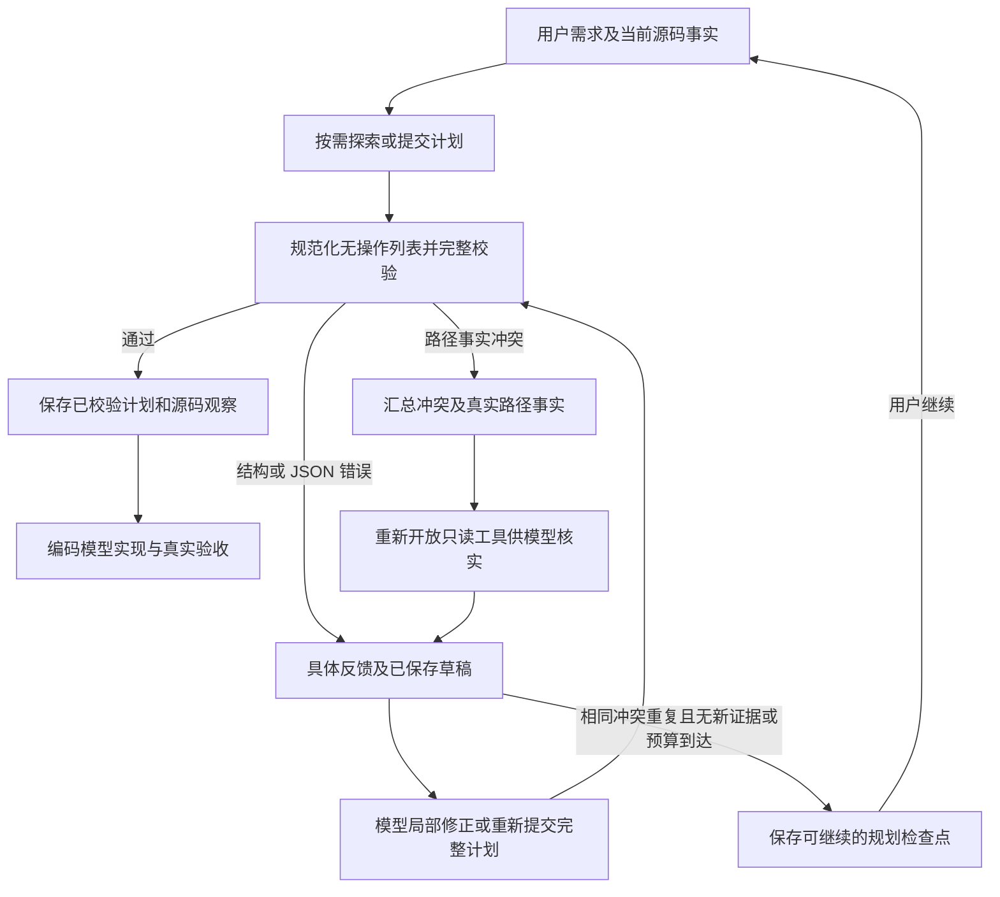

# Agent 规划恢复：根因、通用修复与验证

本次修复针对 Agent 平台的规划、上下文与任务恢复机制，不是代写某个生成应用的后端。

## 实际发生了什么

项目 `4a8385b635ed4ef0a49c232fa2ee13c9` 已有可运行的中文日历前端，数据保存在浏览器 localStorage。2026-10-10 02:33:58（北京时间）新增要求“增加数据持久化，现在换个浏览器打开就没有日程数据了”，02:35:22 规划失败，约 84 秒。

数据库活动日志记录了 5 次 PLAN 模型调用，累计 110,791 个实际输入与输出 Token（含缓存输入；不是费用数值）。前两次定位、读取存储实现，后三次生成整份计划；没有进入 IMPLEMENT，没有尝试编写本次后端代码。

规划依次因缺少 `commands.bootstrap`、声称修改不存在的 `backend/app/routes.py`、声称修改不存在的 `backend/app/db.py` 被拒绝。最后抛出的通用 RuntimeError 被队列当成任务失败，界面显示“构建失败”。

## 根因与对应修复

| 缺陷 | 为什么影响问题解决 | 已实施修复 |
| --- | --- | --- |
| 模板能力被当成项目事实 | 纯前端项目也收到“后端、路由、持久化、部署已配置”的模板说明，诱导模型扩展不存在的函数 | 已有项目使用专门的增量提示，并输出常见模块实际存在性；平台连接器可用不代表业务模块已实现；新增后端由模型规划入口、依赖、服务、代理和迁移 |
| 第一次校验失败就永久进入无工具合成 | 提示模型搜索真实路径，却没有给搜索工具 | 规划分为探索、合成、证据恢复；路径事实冲突重新开放只读工具，结构修正聚焦 JSON |
| 一次只反馈一个路径错误 | 模型修完一个后才得知另一个，消耗整次调用 | `ChangeMapError` 一次报告全部路径、任务映射、需求覆盖冲突，并附存在性、父目录和同名候选事实 |
| 一律要求重生成完整计划 | 已正确的设计反复输出，慢且容易引入新的缺口 | 持久化完整草稿，支持 `plan_patch` 递归对象合并、数组整体替换；修正后完整重新校验 |
| 无操作的可选命令列表也阻塞 | 补一个空数组就要额外模型调用 | 缺省 bootstrap/test 规范化为空列表；不推断 build/dev、服务配置或成功证据；错误类型仍被拒绝 |
| 探索和修正共用固定 5/8 轮 | 三次读取后几乎没有纠错空间 | 分别记录探索和恢复；每次证据恢复最多两轮读取后保留合成机会，避免一直泛读 |
| 规划失败直接进入 error | 原有应用被标成失败，草稿不能沿正常“继续”入口恢复 | 未收敛使用可恢复检查点；job 为 stopped，原有预览存在时项目保持 ready；不把未通过计划交给编码器 |
| “继续”只检查执行账本 | 本次规划尚未产生账本，可能丢失新增需求或恢复旧任务 | 优先恢复未完成规划的原始需求；同源码和配置复用草稿、上下文，变化时重新核验，旧草稿作为未验证输入 |

## 恢复流程



模型负责判断应复用哪个实现、是否新增模块以及如何修改设计。执行器不把不存在的 modify 自动改成 create，不伪造函数、默认启动命令或放宽最终验收。计划修正后仍须通过全部结构、系统合同、任务覆盖和源码路径校验。

`plan_patch` 示例：

```json
{"plan_patch":{"commands":{"services":[{"name":"api","command":"python -m uvicorn backend.main:app --host 0.0.0.0 --port $PORT","port_env":"API_PORT","ready_path":"/api/health"}]}}}
```

这只是合并协议示例，实际模块路径和运行配置必须由模型根据项目确定。对象递归合并；数组完整替换；null 删除对应字段。完整草稿保存在私有规划阶段，另存可分页读取的输出归档，压缩上下文或 Worker 重启后仍可取回。

## 进展、预算和缓存

初始探索仍为：空项目 0 轮，有历史基线 3 轮，无有效基线但已有源码 6 轮；模型可以提前提交计划。出现事实冲突时，允许额外的定向读取，然后回到提交修正，不再永久关闭工具。

同一冲突在同一证据集合下累计出现三次，视为没有收敛并保存检查点。路径错误发生变化、新搜索结果或新读取区间可以支持继续判断；相同读取的缓存提示语变化不算新源码证据。默认兜底为 16 次规划调用、480 秒，可用 `AGENT_PLANNING_MAX_CALLS`、`AGENT_PLANNING_TIMEOUT_SECONDS` 设置。

Token 预算按每次用户消息创建的 job 独立计算，不累计项目之前对话；同一 job 自动恢复时保留已用量，用户发送新消息（包括“继续”）创建新 job 并获得新预算。规划与实现默认共用该 job 的 `AGENT_MAX_TOKENS` × 构建档位倍数额度，普通档默认 15,000,000；不再默认附加 240,000 的规划限制。`AGENT_PLANNING_MAX_TOKENS` 留空采用任务总额度，填写正整数可设置更小的规划上限。

已发生用量优先使用供应商真实 prompt/completion token；仅下一次请求的输入预留使用本地估算，并在整理活动上下文后计算，输出上限受剩余额度约束。真实 usage 不可得时才使用估算兜底；计费始终按供应商 usage。错误提示展示本次对话已用 token、预计输入和上限，便于区分任务预算与模型上下文窗口。

预算与诊断状态随同一 job 持久化，自动恢复不会重置。用户发起新的继续任务时获得新一轮恢复预算，草稿和有效事实保留。这里的预算只保证异常情况下可停止；主要改进是消除错误事实、让模型获取证据和低成本修正。

阶段标识包含当前请求、源码指纹、模型、档位、工具、专家、附件描述与策略版本；通常还包含有效历史。明确继续未完成规划时，忽略新增“继续”消息造成的历史差异，只有事实与配置一致才复用原上下文。源码或配置变化时建立新上下文，旧草稿保留但必须重新校验。

## 验证与边界

新增测试使用可控模型响应驱动真实规划协调器和真实文件定位工具，覆盖：全部路径冲突汇总、无自动创建、合成后恢复读取、局部修正、多种结构错误连续纠正、只读恢复后保留合成、无进展检查点、原始需求继续、旧失败记录迁移、草稿归档、重复读取去重及命令缺省规范化。

队列集成测试使用真实 PostgreSQL，验证检查点不会产生 error 步骤、原有预览保持可用，以及“继续”优先恢复本次规划而非旧执行账本。相关回归同时覆盖规划交接、源码哈希、会话、系统合同、模板和真实命令执行。

最终回归运行 109 项：108 通过、1 项因未启用 PostgreSQL/协调器专用档位测试而跳过，耗时约 142 秒。测试入口：`backend/tests/test_planning_recovery.py`、`backend/tests/test_job_recovery.py`；最终日志见 `.deploy/agent-planning-final-tests.log`。早期回归还发现三个历史断言仍要求独立诊断模型、额外总结调用或固定 16K 输出上限，已改为检查当前执行机制及真实结果，未放宽功能验收。

旧检查点迁移最终另跑 18 项恢复/队列复核，全部通过，日志为 `.deploy/agent-planning-final-resume-tests.log`；与上面的回归有重复，不合并计算独立用例数。

这轮验证执行机制和保护条件，不等于真实 LLM 自主成功率评估；没有自动修改或重新计费运行用户的原任务。下一步应在固定工程快照上对比“纯前端增加持久化”“现有后端扩展”“历史文档与实际源码不一致”三类真实模型任务，衡量最终成功率、首次有效实现时间、重复整份计划次数和输入 Token。

## 部署状态

2026-10-10 已部署镜像 `sha256:dbaf08b2b3dfef76b748f68274fc1afea3e51a4a80fd2f08f590c68532d5273f` 到 backend、agent-service、preview，三者健康检查及前端 API 代理检查通过。不可变 Worker 镜像另通过 2 项定向烟测，验证旧检查点恢复时注入当前增量上下文、合成后重新开放读取并完成修正。下一次新任务在没有运行中 job 时升级项目 Worker，保留工作区与检查点。原失败任务未被自动重跑；只读检查确认“继续”能恢复其原始持久化需求。
